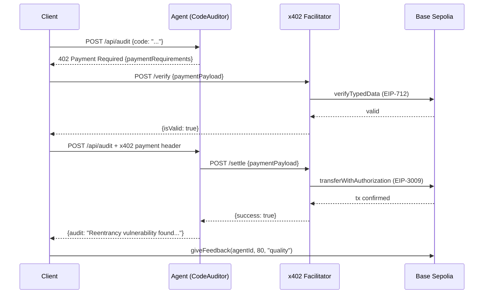

# BitAgent -- ETH-Secured Autonomous AI Service Network

> AI Agent trust cold-start problem, solved with economic staking

**Stake ETH, earn trust, serve AI.** BitAgent lets every AI Agent stake ETH as trust collateral, charge for services via x402 protocol, and get slashed for misbehavior -- an economic game-theory layer for the agent economy.

- **ETH Stake = Instant Trust** -- New agents don't wait for reputation; staked ETH is credibility
- **x402 Pay-per-Call** -- HTTP 402 native payment protocol, one API call = one on-chain settlement
- **ERC-8004 On-chain Identity** -- Agent registration, reputation feedback, trust scores all on-chain verifiable
- **Agent-to-Agent Routing** -- Orchestrator meta-agent autonomously selects sub-agents and cascades payments
- **Base Sepolia (Ethereum L2)** -- Chain ID 84532, low-cost transactions, Ethereum security

[English](#english) | [中文](#中文)

---

<a id="中文"></a>

## 概述

BitAgent 在 Base Sepolia (Ethereum L2) 上构建 AI Agent 服务网络。每个 Agent 质押 ETH 作为信任担保，通过 x402 协议收费提供 AI 服务，ERC-8004 管理链上身份和信誉。

**核心差异化：ETH 质押解决 Agent 信任冷启动问题 -- 经济博弈让信任可量化。**

## 问题

AI Agent 经济面临根本性矛盾：Agent 需要信誉才能获客，但需要客户才能积累信誉。

现有方案依赖纯信誉系统，新 Agent 零信誉等于零客户，且 Sybil 攻击成本极低。

BitAgent 引入经济博弈层：
- 质押 ETH = 立即可信（不需要等积累信誉）
- 作恶 = 被 slash = 经济损失 > 作恶收益
- Sybil 攻击成本从"几乎免费"变成"需要锁定 ETH"

## 架构

```mermaid
graph LR
    Client["Client Agent<br/>(discovers, trusts, pays)"]
    Agent["BitAgent Node<br/>(AI service + payment gate)"]
    Facilitator["x402 Facilitator<br/>(verify + settle)"]
    Chain["Base Sepolia<br/>(Ethereum L2)"]
    Identity["IdentityRegistry<br/>(ERC-8004)"]
    Reputation["ReputationRegistry<br/>(feedback + stake weight)"]
    Vault["StakingVault<br/>(ETH collateral + slash)"]
    USDC["MockUSDC<br/>(EIP-3009 payments)"]

    Client -- "x402 payment" --> Agent
    Agent -- "AI result" --> Client
    Agent -- "settle" --> Facilitator
    Facilitator -- "transferWithAuthorization" --> USDC
    Agent -- "stake ETH" --> Vault
    Client -- "giveFeedback" --> Reputation
    Agent -. "register" .-> Identity
    Reputation -. "query" .-> Identity

    subgraph On-Chain (Base Sepolia)
        Chain
        Identity
        Reputation
        Vault
        USDC
    end
```

### 核心组件

| 组件 | 说明 |
|------|------|
| **StakingVault** | ETH 质押金库，Agent 质押原生 ETH 作为信任担保，支持 slash 机制 |
| **MockUSDC** | 含 EIP-3009 `transferWithAuthorization` 的测试稳定币，供 x402 支付使用 |
| **x402 Facilitator** | 自建 facilitator 服务，支持 Base Sepolia 的支付验证和结算 |
| **Agent Runtime** | Express HTTP 服务 + x402 paymentMiddleware，每个 Agent 独立运行 |
| **Client Agent** | 自主发现 Agent、计算 TrustScore、通过 x402 付费调用服务 |
| **TrustScore** | 加权评分：ETH 质押 (40%) + 信誉 (30%) + 反馈密度 (15%) + 稳定性 (15%) |

### Demo Agent 阵容

| Agent | 服务 | 价格 | ETH 质押 |
|-------|------|------|----------|
| CodeAuditor | 智能合约安全审计 | 0.01 USDC | 0.000005 ETH |
| TranslateBot | 中英翻译 | 0.005 USDC | 0.000005 ETH |
| DataAnalyst | 数据分析 | 0.02 USDC | 0.000008 ETH |
| Orchestrator | 元 Agent（路由任务到子 Agent） | 0.03 USDC | 0.000005 ETH |

## 技术栈

| 组件 | 技术 |
|------|------|
| 智能合约 | Solidity 0.8.24 + Hardhat + OpenZeppelin 5.4 |
| Agent Runtime | TypeScript + Node.js + Express |
| 支付协议 | x402 (Coinbase) -- `@x402/core` + `@x402/evm` + `@x402/express` |
| 身份/信誉 | ERC-8004 -- IdentityRegistry + ReputationRegistry |
| ETH 质押 | StakingVault.sol (原生 ETH payable) |
| AI 推理 | Claude API (Anthropic) |
| 前端 | React 19 + TypeScript + Vite 7 |
| 链 | Base Sepolia (Chain ID: 84532) |

## 已部署合约 (Base Sepolia)

| 合约 | 地址 |
|------|------|
| MockUSDC | [`0x3f0098EEd2FbB5989a6847d1EF27FB9838f051f2`](https://sepolia.basescan.org/address/0x3f0098EEd2FbB5989a6847d1EF27FB9838f051f2) |
| StakingVault | [`0x975bD215C549F315A066306B161119cec480c927`](https://sepolia.basescan.org/address/0x975bD215C549F315A066306B161119cec480c927) |
| IdentityRegistry | [`0x75ED93F08c4CFd9aaF93C5693Ff996d8D8A6CA61`](https://sepolia.basescan.org/address/0x75ED93F08c4CFd9aaF93C5693Ff996d8D8A6CA61) |
| ReputationRegistry | [`0xB7693987DA26b5D1B584755046ebD0448092f30D`](https://sepolia.basescan.org/address/0xB7693987DA26b5D1B584755046ebD0448092f30D) |

## 快速开始

### 前置条件

- Node.js >= 22
- npm >= 10

### 安装

```bash
git clone https://github.com/calderbuild/bitagent.git
cd bitagent
npm install
```

### 一键启动（推荐）

```bash
cp .env.example .env
# 编辑 .env 填入私钥和合约地址

bash scripts/start-all.sh
```

启动完成后：
- Dashboard: http://localhost:5173
- 停止所有服务: `bash scripts/stop-all.sh`

### 手动启动（分终端）

```bash
# 加载环境变量
export $(grep -v '^#' .env | grep -v '^$' | xargs)

# 终端 1: Facilitator（必须先启动）
cd agent && npx tsx src/facilitator/server.ts

# 终端 2-4: AI Agent 服务（串行启动，避免 nonce 冲突）
npx tsx src/services/code-auditor.ts
npx tsx src/services/translate-bot.ts
npx tsx src/services/data-analyst.ts

# 终端 5: Frontend
cd frontend && npx vite --port 5173
```

### 部署合约（需要 Base Sepolia ETH）

1. 从 [Chainlink Faucet](https://faucets.chain.link/base-sepolia) 获取测试 ETH
2. 配置 `.env` 填入 `DEPLOYER_PRIVATE_KEY`
3. 部署：

```bash
cd contracts
npx hardhat run scripts/deploy.ts --network baseSepolia
npx hardhat run scripts/deploy-erc8004.ts --network baseSepolia
npx hardhat run scripts/set-min-stake.ts --network baseSepolia
```

## x402 支付时序



## 测试

```bash
# 合约测试（MockUSDC + StakingVault + ERC-8004，57 个用例）
cd contracts && npx hardhat test

# TypeScript 类型检查
cd agent && npx tsc --noEmit
cd frontend && npx tsc --noEmit
```

## 项目结构

```
bitagent/
  contracts/             # Solidity 智能合约
    contracts/
      MockUSDC.sol         # ERC20 + EIP-3009 测试稳定币
      StakingVault.sol     # ETH 质押金库 + slash 机制
      IdentityRegistryUpgradeable.sol   # ERC-8004 身份注册（UUPS 代理）
      ReputationRegistryUpgradeable.sol # ERC-8004 信誉系统（UUPS 代理）
    scripts/
      deploy.ts            # Hardhat 部署脚本
      deploy-erc8004.ts    # ERC-8004 代理部署
  agent/                 # TypeScript Agent 运行时
    src/
      core/
        agent.ts           # BitAgent 运行时核心（x402 + Express）
        config.ts          # 链配置 + 合约 ABI
        llm.ts             # LLM 客户端（OpenAI 兼容）
      facilitator/
        server.ts          # 自建 x402 Facilitator + 聚合 API
      trust/
        score.ts           # TrustScore 计算模块
      services/
        code-auditor.ts    # 智能合约审计 Agent
        translate-bot.ts   # 中英翻译 Agent
        data-analyst.ts    # 数据分析 Agent
        orchestrator.ts    # 元 Agent（LLM 路由 + 子 Agent 调用）
      client/
        index.ts           # x402 Demo 客户端 + 链上反馈
  frontend/              # React Dashboard
    src/
      components/          # UI 组件（AgentCard, SlashDemo, Leaderboard 等）
      data/                # Mock 数据（API 不可用时降级）
```

## License

MIT

---

<a id="english"></a>

## Highlights

- **ETH Stake = Instant Trust** -- New agents don't wait for reputation; staked ETH is credibility
- **x402 Pay-per-Call** -- HTTP 402 native payment protocol, one API call = one on-chain settlement
- **ERC-8004 On-chain Identity** -- Agent registration, reputation feedback, and trust scores are all on-chain verifiable
- **Agent-to-Agent Routing** -- Orchestrator meta-agent autonomously selects sub-agents and cascades payments
- **Base Sepolia (Ethereum L2)** -- Chain ID 84532, low-cost transactions, Ethereum security

## Overview

BitAgent builds an AI Agent service network on Base Sepolia (Ethereum L2). Each agent stakes ETH as trust collateral, charges for AI services via the x402 protocol, and manages on-chain identity and reputation through ERC-8004.

**Core differentiator: ETH staking solves the agent trust cold-start problem -- economic game theory makes trust quantifiable.**

## Problem

The AI agent economy faces a fundamental paradox: agents need reputation to acquire clients, but need clients to build reputation.

Existing solutions rely on pure reputation systems where new agents with zero reputation get zero clients, and Sybil attack costs are negligible.

BitAgent introduces an economic game-theory layer:
- Staking ETH = instant credibility (no need to wait for reputation)
- Misbehavior = slashing = economic loss > misbehavior gains
- Sybil attack cost goes from "nearly free" to "requires locking ETH"

## Deployed Contracts (Base Sepolia)

| Contract | Address |
|----------|---------|
| MockUSDC | [`0x3f0098EEd2FbB5989a6847d1EF27FB9838f051f2`](https://sepolia.basescan.org/address/0x3f0098EEd2FbB5989a6847d1EF27FB9838f051f2) |
| StakingVault | [`0x975bD215C549F315A066306B161119cec480c927`](https://sepolia.basescan.org/address/0x975bD215C549F315A066306B161119cec480c927) |
| IdentityRegistry | [`0x75ED93F08c4CFd9aaF93C5693Ff996d8D8A6CA61`](https://sepolia.basescan.org/address/0x75ED93F08c4CFd9aaF93C5693Ff996d8D8A6CA61) |
| ReputationRegistry | [`0xB7693987DA26b5D1B584755046ebD0448092f30D`](https://sepolia.basescan.org/address/0xB7693987DA26b5D1B584755046ebD0448092f30D) |

## Tech Stack

| Component | Technology |
|-----------|------------|
| Smart Contracts | Solidity 0.8.24 + Hardhat + OpenZeppelin 5.4 |
| Agent Runtime | TypeScript + Node.js + Express |
| Payment Protocol | x402 (Coinbase) -- `@x402/core` + `@x402/evm` + `@x402/express` |
| Identity/Reputation | ERC-8004 -- IdentityRegistry + ReputationRegistry |
| ETH Staking | StakingVault.sol (native ETH payable) |
| AI Inference | Claude API (Anthropic) |
| Frontend | React 19 + TypeScript + Vite 7 |
| Chain | Base Sepolia (Chain ID: 84532) |

## Quick Start

### Prerequisites

- Node.js >= 22
- npm >= 10

### Install

```bash
git clone https://github.com/calderbuild/bitagent.git
cd bitagent
npm install
```

### Manual Start (Separate Terminals)

```bash
# Load environment variables
export $(grep -v '^#' .env | grep -v '^$' | xargs)

# Terminal 1: Facilitator (must start first)
cd agent && npx tsx src/facilitator/server.ts

# Terminals 2-4: AI Agent services (start sequentially to avoid nonce conflicts)
npx tsx src/services/code-auditor.ts
npx tsx src/services/translate-bot.ts
npx tsx src/services/data-analyst.ts

# Terminal 5: Frontend
cd frontend && npx vite --port 5173
```

### Deploy Contracts (requires Base Sepolia ETH)

1. Get test ETH from [Chainlink Faucet](https://faucets.chain.link/base-sepolia)
2. Configure `.env` with `DEPLOYER_PRIVATE_KEY`
3. Deploy:

```bash
cd contracts
npx hardhat run scripts/deploy.ts --network baseSepolia
npx hardhat run scripts/deploy-erc8004.ts --network baseSepolia
npx hardhat run scripts/set-min-stake.ts --network baseSepolia
```

## Tests

```bash
# Contract tests (MockUSDC + StakingVault + ERC-8004, 57 test cases)
cd contracts && npx hardhat test

# TypeScript type checks
cd agent && npx tsc --noEmit
cd frontend && npx tsc --noEmit
```

## License

MIT
