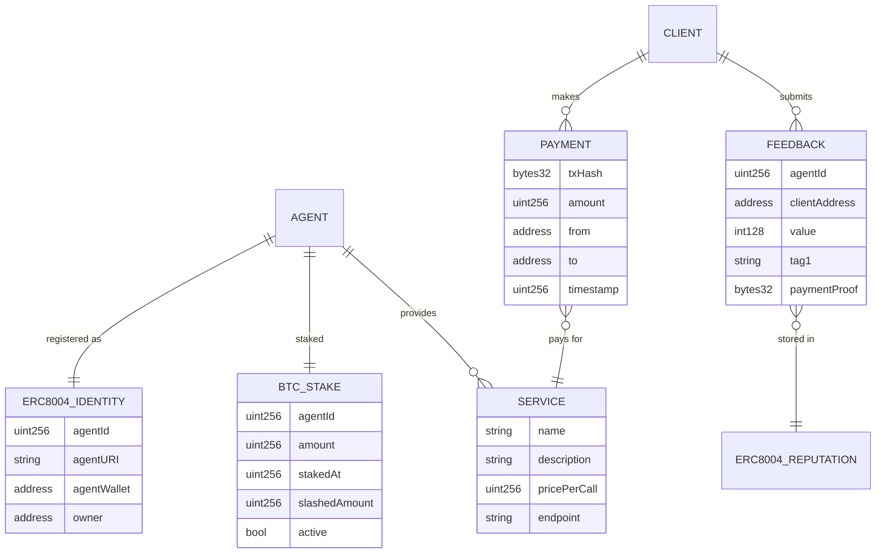

# BitAgent -- BTC 担保的自主 AI 服务网络

## 概述

在 GOAT Network (Bitcoin L2) 上构建一个 AI Agent 服务网络。每个 Agent 质押 BTC 作为信任担保，通过 x402 协议收费提供 AI 服务（代码审计、翻译、数据分析等），ERC-8004 管理链上身份和信誉。BTC 质押解决了所有竞品都面临的 Agent 信任冷启动问题 -- 这是只有 Bitcoin L2 才能做到的差异化。

## 问题陈述

### 核心痛点：AI Agent 信任冷启动问题

AI Agent 经济快速崛起，但存在一个根本性矛盾：

**Agent 需要信誉才能获客，但需要客户才能积累信誉。**

现有方案的局限：
- **ERC-8004 信誉系统**：基于历史反馈，新 Agent 零信誉 = 零客户。且 Sybil 攻击成本低（创建假账户刷好评）
- **Conway Automaton (Base)**：Agent 靠 "earn or die" 机制生存，但信任纯依赖链上声誉，无经济担保
- **NEXUS (SKALE)**：ERC-8004 + A2A + x402 全栈，但 Agent 作恶成本为零（没有 stake）
- **Amiko (Solana)**：链上信用评分，但没有硬性经济抵押

**缺失的一环：经济博弈层。**

如果 Agent 需要质押真金白银（BTC）才能提供服务：
- 质押 = 立即可信（不需要等积累信誉）
- 作恶 = 被 slash = 经济损失 > 作恶收益
- Sybil 攻击成本从"几乎免费"变成"需要锁定 BTC"
- 新 Agent 冷启动：质押 BTC 立即获得信任基线

**这是只有 Bitcoin L2 能做到的事。** BTC 是全球最硬的抵押品。在 Base 上质押 ETH 或 USDC 不具备同等叙事力和安全保障。GOAT Network 的 BitVM2 桥让 BTC 可以真正用于链上经济博弈。

### 为什么这个问题值得解决

- Agent 信任是 Agent 经济规模化的首要瓶颈（痛点严重度 9/10）
- 2026 年 x402 黑客松遍地（Solana、EF、SKALE、Coinbase、Cronos），但无一解决 BTC 担保信任
- GOAT 黑客松评委明确要求 "x402 + AI + Bitcoin" 融合
- "Bitcoin-backed AI agents" 叙事极强，与赛事主题完美契合

## 竞品分析

| 项目 | 链 | 有 x402 | 有 ERC-8004 | 有 BTC 担保 | 信任机制 |
|------|------|---------|------------|------------|---------|
| **BitAgent (本项目)** | **GOAT (BTC L2)** | **Yes** | **Yes** | **Yes** | **BTC 质押 + 信誉** |
| Conway Automaton | Base | Yes | Yes | No | 纯信誉 |
| NEXUS | SKALE | Yes | Yes | No | 纯信誉 |
| Amiko | Solana | Yes | No | No | 链上信用评分 |
| i3 | Solana | Yes | No | No | 平台背书 |
| SugarClawdy | Solana | Yes | No | No | 托管 + 仲裁 |

**BitAgent 是唯一将 BTC 经济安全引入 Agent 信任的项目。**

## 方案概述

```
                                    ERC-8004
                                    Identity
                                       |
+----------------+   x402 payment   +--+---------------+    BTC stake    +------------------+
|  Client Agent  | ---------------> |  BitAgent Node   | <-------------> |  GOAT Network    |
|  (discovers,   | <-- AI result    |  (AI service +   |    settlement   |  (Bitcoin L2)    |
|   trusts,      |                  |   payment gate)  |                 |                  |
|   pays)        |   ERC-8004       +--+---------------+                 |  StakingVault    |
+----------------+   reputation        |                                |  contract        |
                         |             |                                +------------------+
                         v             v
                  +--------------------+
                  | Reputation Registry|
                  | (feedback + BTC    |
                  |  stake weight)     |
                  +--------------------+
```

### 核心机制

**1. BTC 信任质押 (Trust Staking)**

```
Agent 注册流程:
1. Agent 向 StakingVault 合约质押 BTC (GOAT testnet)
2. StakingVault 记录: agentId -> stakeAmount -> stakeTimestamp
3. Agent 在 ERC-8004 Identity Registry 注册身份
4. agentURI 中声明: 服务能力、x402 定价、质押金额
5. 客户端可查询: trust_score = f(btc_stake, reputation, uptime)
```

**2. x402 服务调用 + 付费**

```
调用流程:
1. Client Agent 查询 ERC-8004 获取可用 Agent 列表
2. Client 按 trust_score 排序 (BTC stake 权重 > 信誉权重)
3. Client 向 BitAgent 发送服务请求
4. BitAgent 返回 HTTP 402 + x402 PaymentRequirements
5. Client 签名支付 -> Facilitator 结算 -> BitAgent 执行 AI 任务 -> 返回结果
```

**3. 信誉反馈 + Slash 机制**

```
反馈流程:
1. Client 收到结果后向 ERC-8004 Reputation Registry 提交反馈
2. 反馈包含: value (评分), tag1 ("successRate"), proofOfPayment (tx hash)
3. 如果多个 Client 提交负面反馈 (value < threshold):
   -> 触发 StakingVault.slash(agentId, amount)
   -> Agent 的 BTC 质押被部分扣除
   -> trust_score 下降
```

## 技术方案

### 技术栈

| 组件 | 技术 | 理由 |
|------|------|------|
| Agent Runtime | TypeScript (Node.js) | x402 SDK + MCP SDK 主力语言 |
| 智能合约 | Solidity | GOAT = Type-1 zkEVM，完全兼容 |
| AI 推理 | Claude API / OpenAI API | Agent 提供 AI 服务的后端 |
| 支付协议 | x402 (Coinbase) exact scheme | HTTP-native Agent 支付标准 |
| 身份/信誉 | ERC-8004 contracts | Agent 发现与信任基础设施 |
| BTC 质押 | 自研 StakingVault.sol | GOAT 上 BTC 质押 + slash |
| 前端 | React + Vite | Demo Day 展示面板 |
| 数据库 | SQLite (Agent 本地) | Agent 状态持久化 |

### 核心合约

#### StakingVault.sol -- BTC 质押金库

```solidity
// contracts/StakingVault.sol
// SPDX-License-Identifier: MIT
pragma solidity ^0.8.20;

contract StakingVault {
    struct Stake {
        uint256 amount;        // BTC 质押量 (wei)
        uint256 stakedAt;      // 质押时间
        uint256 slashedAmount; // 已被 slash 的量
        bool active;
    }

    mapping(uint256 => Stake) public agentStakes; // agentId -> Stake
    address public identityRegistry;
    address public slashOracle; // 可以触发 slash 的地址

    event Staked(uint256 indexed agentId, uint256 amount);
    event Slashed(uint256 indexed agentId, uint256 amount, string reason);
    event Unstaked(uint256 indexed agentId, uint256 amount);

    // Agent 质押 BTC (GOAT 上 BTC 是原生 gas token)
    function stake(uint256 agentId) external payable {
        require(msg.value > 0, "Must stake BTC");
        agentStakes[agentId].amount += msg.value;
        agentStakes[agentId].stakedAt = block.timestamp;
        agentStakes[agentId].active = true;
        emit Staked(agentId, msg.value);
    }

    // 查询有效质押 (总质押 - 已 slash)
    function effectiveStake(uint256 agentId) external view returns (uint256) {
        Stake storage s = agentStakes[agentId];
        return s.amount - s.slashedAmount;
    }

    // Slash 作恶 Agent
    function slash(uint256 agentId, uint256 amount, string calldata reason) external {
        require(msg.sender == slashOracle, "Only oracle can slash");
        Stake storage s = agentStakes[agentId];
        require(s.active, "Agent not staked");
        uint256 effective = s.amount - s.slashedAmount;
        uint256 slashAmt = amount > effective ? effective : amount;
        s.slashedAmount += slashAmt;
        emit Slashed(agentId, slashAmt, reason);
    }

    // Agent 退出质押 (需要等待冷却期)
    function unstake(uint256 agentId) external {
        // 省略: 验证 caller 是 agent owner, 检查冷却期
        Stake storage s = agentStakes[agentId];
        uint256 withdrawable = s.amount - s.slashedAmount;
        s.active = false;
        s.amount = 0;
        payable(msg.sender).transfer(withdrawable);
        emit Unstaked(agentId, withdrawable);
    }
}
```

#### TrustScore 计算 (链下/合约内)

```typescript
// src/trust/score.ts
interface TrustInput {
  btcStake: bigint;           // Agent 的 BTC 质押量
  reputationScore: number;    // ERC-8004 信誉分 (0-100)
  feedbackCount: number;      // 收到的反馈数量
  slashHistory: number;       // 被 slash 次数
  uptimeDays: number;         // 在线天数
}

function calculateTrustScore(input: TrustInput): number {
  // BTC 质押权重最高 (40%) -- 这是核心差异化
  const stakeScore = Math.min(Number(input.btcStake) / 1e16, 100) * 0.4;
  // 信誉分 (30%)
  const repScore = input.reputationScore * 0.3;
  // 反馈密度 (15%)
  const feedbackScore = Math.min(input.feedbackCount / 50, 1) * 15;
  // 稳定性 (15%) -- 从未被 slash + 长期在线
  const stabilityScore = (input.slashHistory === 0 ? 10 : 0) +
    Math.min(input.uptimeDays / 30, 1) * 5;

  return stakeScore + repScore + feedbackScore + stabilityScore;
}
```

### Agent Runtime 架构

```typescript
// src/agent/runtime.ts -- Agent 运行时核心
class BitAgent {
  private wallet: ethers.Wallet;
  private agentId: bigint;
  private service: AIService;       // 实际 AI 服务 (审计/翻译/分析)
  private x402Server: Express;      // HTTP server with x402 middleware

  async boot() {
    // 1. 生成或加载钱包
    this.wallet = loadOrCreateWallet();
    // 2. 质押 BTC
    await this.stakeBTC(STAKE_AMOUNT);
    // 3. 注册 ERC-8004 身份
    this.agentId = await this.registerIdentity();
    // 4. 启动 x402 服务端
    this.startX402Server();
    // 5. 进入主循环: 监听请求, 执行服务, 记录收益
    this.runLoop();
  }

  private startX402Server() {
    this.x402Server = express();
    // x402 middleware: 客户端调用 /api/audit 时返回 402
    this.x402Server.use(paymentMiddleware({
      "POST /api/audit": {
        accepts: [{
          scheme: "exact",
          network: "eip155:48816",  // GOAT testnet
          amount: "10000",          // 0.01 USDC
          asset: USDC_ADDRESS,
          payTo: this.wallet.address,
          maxTimeoutSeconds: 300,
        }],
        description: "AI Smart Contract Audit",
      },
    }));

    // 付费后的实际服务端点
    this.x402Server.post("/api/audit", async (req, res) => {
      const result = await this.service.audit(req.body.code);
      res.json(result);
    });
  }
}
```

### Demo Agent 阵容

| Agent 名称 | AI 服务 | x402 定价 | 描述 |
|-----------|---------|----------|------|
| CodeAuditor | 智能合约审计 | 0.01 USDC/次 | 输入 Solidity 代码，返回安全审计报告 |
| TranslateBot | 中英翻译 | 0.005 USDC/次 | 输入文本，返回高质量翻译 |
| DataAnalyst | 数据分析 | 0.02 USDC/次 | 输入 CSV/JSON，返回分析洞察 |

每个 Agent 质押不同量的 BTC，展示 trust_score 差异。

### Demo 客户端 Agent

一个自主决策的 Client Agent，Demo 中执行：
1. 查询 ERC-8004 发现所有已注册 Agent
2. 查询每个 Agent 的 BTC 质押量 + 信誉分
3. 计算 trust_score，选择最可信的 Agent
4. 通过 x402 支付 + 调用服务
5. 评估结果质量，提交链上反馈
6. 展示一个 Agent 被 slash 后 trust_score 下降的场景

### Demo 前端面板

简洁的 Web UI：
- **Agent 注册表**：列出所有 Agent、BTC 质押量、trust_score、服务描述
- **实时交易流**：显示 x402 支付和 AI 服务调用的实时日志
- **信任排行榜**：按 trust_score 排序的 Agent 列表
- **Slash 演示**：一键触发 slash，观察 trust_score 实时变化
- **链上验证**：所有数据可在 GOAT Explorer 上查看

## 数据模型



## 深入技术实现细节（研究验证）

### GOAT Network 技术确认

| 技术点 | 确认状态 | 细节 |
|--------|---------|------|
| BTC 作为原生 gas | 已确认 | `msg.value` 直接是 BTC (18 decimals)，`payable` 函数正常工作 |
| WGBTC (Wrapped) | 已确认 | `0xbC10000000000000000000000000000000000000`，支持 ERC20+Permit |
| 预部署稳定币 | **不存在** | Testnet3 无 USDC/USDT，必须自行部署 Mock USDC |
| ERC-8004 | **未部署** | 需要自行部署 UUPS 代理（可跳过 vanity 地址） |
| 出块时间 | ~3.5 秒 | CometBFT 即时终局性 |
| Bitcoin State Oracle | `0xbc10...0005` | 可查询 BTC 区块高度/时间戳（独特功能） |
| CREATE2 部署器 | `0x4e59b44...c` | 标准 DeterministicCreate2Deployer 可用 |

### x402 集成路径（已验证可行）

**关键发现：x402 Facilitator 不是合约，是 HTTP 服务。** 可以自建 inline facilitator。

```typescript
// 自建 Facilitator（无需独立服务）-- 已验证可行
import { x402Facilitator } from "@x402/core/facilitator";
import { ExactEvmScheme } from "@x402/evm/facilitator";
import { toFacilitatorEvmSigner } from "@x402/evm/signer";

const goatChain = { id: 48816, name: "GOAT Testnet3", ... };
const wallet = createWalletClient({
  account: privateKeyToAccount(FACILITATOR_KEY),
  chain: goatChain,
  transport: http("https://rpc.testnet3.goat.network"),
}).extend(publicActions);

const facilitator = new x402Facilitator();
facilitator.register("eip155:48816", new ExactEvmScheme(toFacilitatorEvmSigner(wallet)));
```

**x402 支付流程（v2 协议）：**
1. Client 请求 -> Server 返回 HTTP 402 + `PAYMENT-REQUIRED` header (base64 JSON)
2. Client 签 EIP-712 typed data (`TransferWithAuthorization`) -> 重新请求 + `PAYMENT-SIGNATURE` header
3. Server 调 facilitator `/verify` -> 如果有效则执行 handler
4. Handler 返回成功 -> Server 调 facilitator `/settle` (facilitator 提交 `transferWithAuthorization` 上链)
5. 如果 handler 返回错误 (>=400) -> **不结算**，不扣费

**Mock USDC 必须实现的接口：**
```solidity
// 必须实现 EIP-3009 transferWithAuthorization
function transferWithAuthorization(
    address from, address to, uint256 value,
    uint256 validAfter, uint256 validBefore, bytes32 nonce,
    uint8 v, bytes32 r, bytes32 s
) external;

// 以及 EIP-712 domain
function DOMAIN_SEPARATOR() external view returns (bytes32);
```

### ERC-8004 部署路径（已验证可行）

**最简部署方式（跳过 vanity 地址）：**

```typescript
// hardhat deploy script
const IdentityImpl = await ethers.deployContract("IdentityRegistryUpgradeable");
const identityProxy = await ethers.deployContract("ERC1967Proxy", [
  IdentityImpl.target,
  IdentityImpl.interface.encodeFunctionData("initialize"),
]);

const RepImpl = await ethers.deployContract("ReputationRegistryUpgradeable");
const repProxy = await ethers.deployContract("ERC1967Proxy", [
  RepImpl.target,
  RepImpl.interface.encodeFunctionData("initialize", [identityProxy.target]),
]);
```

**依赖版本：** OpenZeppelin 5.4.0, Solidity 0.8.24, optimizer 200 runs

### StakingVault 设计（已验证 BTC payable 可行）

BTC 质押直接用 `payable` 函数，无需 WGBTC 包装：

```solidity
function stake(uint256 agentId) external payable {
    require(msg.value > 0, "Must stake BTC");
    // msg.value 是 BTC (18 decimals)
    // 1 BTC = 1e18 Wei on GOAT
    agentStakes[agentId].amount += msg.value;
    // ...
}
```

## 实现阶段

### 最新进展（2026-02-20）

- 已完成并推送：`18b0d03` (`feat: connect frontend to real chain data, add ERC-8004 registration and on-chain slash`)
- 已验证链上 slash 交易：`0xcd2fa01f...`（CodeAuditor trust 分从 25.2 降到 22.2，并触发排行榜重排）
- 前端当前采用 **3-8 秒轮询** facilitator API（`/api/agents`、`/api/stats`、`/api/events`），非 WebSocket 模式

### Phase 1: 合约层 (Day 1-7)

**1.1 部署 Mock USDC（含 EIP-3009）**
- [x] 编写 MockUSDC.sol -- ERC20 + EIP-3009 `transferWithAuthorization` + EIP-712
- [x] 参考 Circle FiatTokenV2 实现 `transferWithAuthorization`
- [x] 部署到 GOAT Testnet3 并 mint 测试代币 (MockUSDC: 0xB0035182Fb5EA1d65F2B41F04207a441664F7a67)

**1.2 部署 ERC-8004 注册表**
- [x] Fork erc-8004-contracts 仓库（手动移植合约，修改 initializer 为 fresh deploy）
- [x] 添加 GOAT Testnet3 网络配置到 hardhat.config.ts
- [x] 编写简化部署脚本（UUPS 代理，跳过 vanity）
- [x] 部署 IdentityRegistryUpgradeable + ReputationRegistryUpgradeable (Identity proxy: 0x230760453aB274665f40c05a9785d5c75d1ec493, Reputation proxy: 0xcfdcba21CFCa75B192e2B8De92fD85a473C50e0C)
- [x] 验证: register() + tokenURI() + getAgentWallet() 通过

**1.3 部署 StakingVault**
- [x] 编写 StakingVault.sol（BTC payable 质押 + slash + unstake）
- [x] 部署到 GOAT Testnet3 (StakingVault: 0xF1A94cab9681dBC28d3D4F21a9Ce58787920546B)
- [x] 验证: stake() + effectiveStake() + slash()

**1.4 搭建 x402 Facilitator**
- [x] 创建 inline facilitator（使用 @x402/core + @x402/evm）
- [x] 注册 GOAT Network (eip155:48816) 支持
- [x] 注册自定义 money parser（映射 Mock USDC 地址 + EIP-712 domain）
- [x] 验证: verify() + settle() 端到端

**1.5 端到端集成测试**
- [x] 脚本完成: 质押 BTC -> 注册 ERC-8004 身份 -> x402 支付 -> 查信誉 -> slash

**验收标准**: 一个 Hardhat 脚本跑通完整流程，交易在 GOAT Explorer 可查

### Phase 2: Agent Runtime (Day 8-18)

**2.1 Agent 框架核心**
- [x] Agent 启动流程: 生成钱包 -> 质押 BTC -> 注册 ERC-8004 -> 启动 HTTP server
- [ ] Agent 状态持久化 (SQLite): agentId, wallet, stake, earnings（当前主要使用链上数据 + 进程内状态）
- [x] x402 HTTP server: Express + paymentMiddleware + 自建 inline facilitator
- [x] TrustScore 计算模块（链上查询 BTC stake + ERC-8004 reputation）

**2.2 三个 Demo AI 服务**
- [x] CodeAuditor: 接收 Solidity 代码 -> 调 LLM API -> 返回审计报告
- [x] TranslateBot: 接收文本 -> 调 LLM API -> 返回翻译
- [x] DataAnalyst: 接收 CSV/JSON -> 调 LLM API -> 返回分析洞察

**2.3 Client Agent**
- [x] 查询 ERC-8004 获取已注册 Agent 列表
- [x] 查询 StakingVault 获取每个 Agent 的 BTC 质押
- [x] 计算 TrustScore 并排序
- [x] 使用 @x402/fetch wrapFetchWithPayment 自动处理付费
- [x] 调用后提交 ERC-8004 反馈

**验收标准**: 3 个 Agent 各自运行在独立端口 + Client Agent 自主选择并完成调用

### Phase 3: 前端 + Demo (Day 19-25)

- [x] Web 前端面板 (React + Vite)
  - Agent Dashboard: 列出所有 Agent + BTC stake + TrustScore + 状态
  - 实时交易流: 轮询 `/api/events` 展示 x402/质押/slash 事件
  - 信任排行榜: 按 TrustScore 排序
  - Slash 演示: 按钮触发链上 `StakingVault.slash()`，实时观察 TrustScore 变化
- [ ] 编写 5 分钟 Demo 脚本
- [x] 端到端测试
- [ ] 录制备用 Demo 视频

**验收标准**: Demo 无人工干预流畅运行，链上数据在 GOAT Explorer 可验证

### Phase 4: 文档 + 提交 (Day 26-28)

- [x] README (中英双语): 项目简介、架构图、快速开始、Demo 说明
- [x] 代码仓库整理 + 开源许可
- [ ] 提交参赛材料到 Google Forms（待人工确认提交）

## 风险分析（已更新）

| 风险 | 概率 | 影响 | 缓解措施 |
|------|------|------|----------|
| Mock USDC 的 EIP-3009 实现有 bug | 中 | 高 | 参考 Circle FiatTokenV2 源码；编写完整测试用例 |
| GOAT Testnet3 上无预部署稳定币 | **已确认** | 高 | Mock USDC 是 Phase 1 第一步 |
| x402 SDK 对 GOAT 链兼容性问题 | 中 | 中 | 自建 inline facilitator 绕过链支持列表 |
| ERC-8004 UUPS 代理部署失败 | 低 | 中 | 跳过 vanity 用标准 ERC1967Proxy |
| BTC payable 函数在 GOAT 上行为异常 | 低 | 高 | **已确认 BTC 是原生 gas，payable 正常工作**；备选 WGBTC |
| AI 服务调用延迟影响 Demo | 中 | 中 | 预热 API、缓存常见查询、准备离线 mock |
| Demo Day Testnet3 宕机 | 低 | 高 | 本地 Hardhat fork + 预录视频双保险 |

## 为什么这个方向能赢

1. **叙事绝杀**："Bitcoin-backed AI agents" -- 这是 Bitcoin L2 黑客松最强的叙事。Conway 和 NEXUS 都在 EVM L2 上做，没有人把 BTC 作为 Agent 信任锚点。

2. **真实痛点**：Agent 信任冷启动问题是所有 Agent 经济项目的共同难题。BTC 质押是一个优雅的经济学解法，而非纯技术解法。

3. **赛题完美契合**：同时使用 x402 (支付) + ERC-8004 (身份/信誉) + BTC (信任担保) + AI (服务) + GOAT Network (结算层)。

4. **Demo 效果极好**：观众可以直观看到 Agent 质押 BTC、自主选择最可信服务、付费调用、slash 作恶 Agent -- 全程链上可验证。

5. **延展性**：获奖后可直接入驻 One Piece Season 5，所有使用该产品的用户获得 GOATED 空投。BTC 质押机制可以扩展到任何类型的 Agent 服务。

## 关键技术发现备注

1. **GOAT Network 上 BTC 是原生 gas token**（类似 ETH 在 Ethereum 上的角色），合约可通过 `payable` 函数直接接收 BTC，无需 wrapped token。

2. **GOAT 使用 CometBFT 共识，即时终局性**，x402 支付确认无需等待。

3. **`github.com/GOATNetwork/x402` 实际重定向到 ERC-8004 合约仓库**，其中 `goatx402-sdk/` 目录包含 GOAT 特定的 x402 适配。Coinbase `github.com/coinbase/x402` 是协议核心。

4. **ERC-8004 合约已在 15+ 链上通过 CREATE2 部署**，但不包括 GOAT，需自行部署。Testnet 地址格式：`0x8004...`。

5. **x402 exact scheme 依赖 EIP-3009 (transferWithAuthorization)**，需要自行部署 Mock USDC。

## 参考资源

- GOAT 开发指南：https://docs.goat.network/builders/quick-start
- GOAT Testnet3：Chain ID 48816, RPC `https://rpc.testnet3.goat.network`
- GOAT Faucet：https://bridge.testnet3.goat.network/faucet
- x402 协议 (Coinbase)：https://github.com/coinbase/x402
- GOAT x402 参考集成：https://github.com/erc-8004/erc-8004-contracts
- ERC-8004 规范：https://eips.ethereum.org/EIPS/eip-8004
- Conway Automaton (竞品参考)：https://github.com/Conway-Research/automaton
- openx402 Facilitator (竞品参考)：https://openx402.ai
- NEXUS (竞品参考)：https://dorahacks.io/buidl/39323
- 黑客松交流群：https://t.me/goat_agent_hackathon
